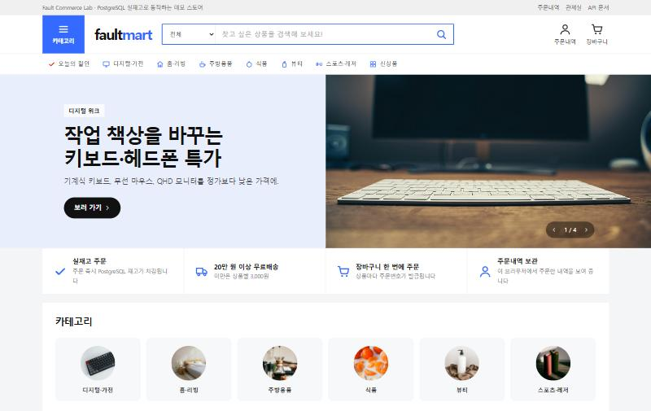

# Fault Commerce Lab




Fault Commerce Lab L1 is a deliberately healthy, executable commerce core used as the
reference point for later reliability and incident-investigation exercises. It implements only
products, one-to-one inventory, and confirmed orders. The baseline itself contains no injected
faults, artificial delay, in-memory persistence, or hidden recovery behavior.

## Scope and stack

The business API contains four endpoints:

- `POST /products`
- `GET /products` (catalog search, category filter, sort, pagination)
- `GET /products/{product_id}`
- `POST /orders`

Products carry optional storefront attributes (`category`, `brand`, `description`, `list_price`,
`image_url`). They have database defaults, so the original `name`/`unit_price`/`initial_stock`
payload and the Oracle's direct inserts keep working unchanged.

Operational endpoints are `GET /health/live`, `GET /health/ready`, and `GET /metrics`.
FastAPI also exposes `/docs` and `/openapi.json`; ReDoc is disabled. Payment, cancellation,
refunds, coupons, points, shipment, users, authentication, and reviews are outside the L1 scope.
The storefront cart lives in the browser and checks out by calling `POST /orders` once per line.

The implementation uses Python 3.12, FastAPI, PostgreSQL 16, SQLAlchemy 2, psycopg 3, Alembic,
Pydantic Settings, Prometheus client, Docker Compose, pytest, httpx, Ruff, and mypy. SQLite is not
used in development, tests, or runtime.

## Directory structure

```text
app/                 FastAPI, models, schemas, repositories, services, observability
app/frontend/        Responsive storefront, live API lab, and bundled visual assets
alembic/             Versioned PostgreSQL schema migrations
tests/unit/          Pure calculation, validation, error, and utility tests
tests/integration/   PostgreSQL API tests and real-Uvicorn concurrency/restart tests
oracle/              Independent direct-PostgreSQL reset, invariant, and baseline judges
scripts/             HTTP smoke and concurrency probes
tools/               Direct DB snapshot and standalone timeline renderer
logs/                 Host-mounted JSON Lines request logs
artifacts/            Host-mounted generated validation and observation artifacts
```

## Configuration

Copy `.env.example` to `.env` only when local overrides are needed. `.env` is ignored by Git.

| Variable | Purpose | Container default |
| --- | --- | --- |
| `POSTGRES_DB` | PostgreSQL database | `commerce` |
| `POSTGRES_USER` | PostgreSQL user | `commerce` |
| `POSTGRES_PASSWORD` | PostgreSQL password | `commerce` |
| `DATABASE_URL` | SQLAlchemy/psycopg connection URL | composed from the values above |
| `OBSERVABILITY_LEVEL` | `basic` or `detailed` JSON logging | `basic` |
| `LOG_FILE` | JSON Lines destination | `/app/logs/app.jsonl` |
| `DATABASE_POOL_SIZE` | SQLAlchemy persistent connections | `30` |
| `DATABASE_MAX_OVERFLOW` | SQLAlchemy overflow connections | `30` |
| `SEED_CATALOG` | Insert the 24-product demo catalog on startup (skips existing names) | `true` |

Use a non-default password outside this local lab. Secrets and full connection URLs are never
written to application logs.

## Run with Docker

Start PostgreSQL, apply Alembic migrations, and start the API:

```bash
docker compose up -d --build
```

The API is available at `http://localhost:8000`, with interactive documentation at
`http://localhost:8000/docs`. The application waits for PostgreSQL health, applies
`alembic upgrade head`, inserts the demo catalog when `SEED_CATALOG=true`, and only then starts
Uvicorn. `oracle/reset.py` truncates every table, so run `make seed` afterwards to restock the
storefront catalog.

## Interactive storefront

Open [http://localhost:8000](http://localhost:8000) after Compose reports the app healthy.
The root page is 폴트마켓, a Korean marketplace-style storefront served directly by FastAPI and
backed entirely by the real API and PostgreSQL inventory:

- header with category menu, category-scoped search, and a live cart badge;
- home page with a rotating promotion banner, category tiles, a discount ranking, and per-category
  product rows;
- search/category listing with category counts, five sort orders, and pagination;
- product detail page with list price, discount, shipping rule, low-stock and sold-out states,
  quantity selection, add to cart, and buy now;
- browser-side cart with selection, quantity limits refreshed from current stock, and a price
  summary that mirrors the server shipping rule;
- checkout that takes a postal code, places one `POST /orders` per line, reports each line's
  result (including `INSUFFICIENT_STOCK`), and keeps a per-browser order history.

The layout takes reference cues from large Korean marketplaces (dense product grid, prominent
search, discount-first price blocks) while using original branding. Product photos are bundled
Unsplash images; the page never fetches assets from other hosts at runtime.

### Admin control room

Open [http://localhost:8000/admin](http://localhost:8000/admin) for the operations dashboard.
It uses only the existing L1 endpoints and does not add a commerce-domain API. The dashboard:

- reads liveness, readiness, and Prometheus counters;
- creates one isolated probe product with configurable starting inventory;
- fires up to 100 simultaneous order requests from the browser;
- compares the expected 201/409 distribution with the observed responses;
- evaluates the inventory equation and reports either 'INVARIANT HOLDS' or 'INCIDENT DETECTED';
- can export the complete request ledger and verdict as JSON.

The interface uses semantic HTML, keyboard-visible focus states, reduced-motion support, a
mobile layout, and only bundled assets.

### Photo credits

The banner workspace photograph and all 24 product photos are from Unsplash and used under the
[Unsplash License](https://unsplash.com/license). Photographer attribution for every file lives in
`app/frontend/assets/PHOTO_CREDITS.md`.

Stop containers while preserving the PostgreSQL volume:

```bash
docker compose down
```

Stop containers and permanently delete the local PostgreSQL volume:

```bash
docker compose down -v
```

The named `postgres-data` volume preserves data across container recreation. `logs/` and
`artifacts/` are bind-mounted so generated evidence remains available on the host.

## API examples

Create a product and its inventory atomically:

```bash
curl -X POST http://localhost:8000/products \
  -H "Content-Type: application/json" \
  -d '{"name":"Limited Keyboard","unit_price":129000,"initial_stock":10}'
```

Read the product with current inventory:

```bash
curl http://localhost:8000/products/1
```

Create a confirmed order:

```bash
curl -X POST http://localhost:8000/orders \
  -H "Content-Type: application/json" \
  -d '{"product_id":1,"quantity":1,"postal_code":"16841"}'
```

Business errors use one shape and contain the same request ID returned in the response header:

```json
{
  "code": "INSUFFICIENT_STOCK",
  "message": "요청한 수량만큼의 재고가 없습니다.",
  "request_id": "6b2294f66df7472c9532a2fac6279010"
}
```

Invalid input returns HTTP 422, missing products return `PRODUCT_NOT_FOUND` with HTTP 404, and
insufficient inventory returns `INSUFFICIENT_STOCK` with HTTP 409.

## Shipping rule

`ShippingQuoteService` is deterministic and performs no network calls. Merchandise below
200,000 won has a 3,000 won base fee. Postal prefixes 60–99 add 2,500 won. Quantities above two
add 700 won for each additional unit. Free-shipping orders can still carry regional or packaging
surcharges, and the final fee cannot be negative.

## Architecture and transaction boundaries

Routers validate and translate HTTP data, services own transaction boundaries, and repositories
contain SQLAlchemy persistence operations. A new SQLAlchemy Session is created and closed per
request; no Session or Python lock is shared globally.

Product and inventory creation occurs inside one service transaction. Order creation loads the
product price, calculates shipping, performs a conditional PostgreSQL update equivalent to:

```sql
UPDATE inventories
SET current_stock = current_stock - :quantity
WHERE product_id = :product_id AND current_stock >= :quantity
RETURNING current_stock;
```

The confirmed order is inserted before that same transaction commits. PostgreSQL serializes
updates only on the affected inventory row and re-evaluates the stock predicate after a competing
transaction releases it. This prevents negative inventory and over-selling across processes and
application restarts without globally serializing unrelated products.

The strategy is simple, multi-instance safe, and efficient for independent products. A single
very popular product is intentionally serialized at its database row; this is the consistency
cost of strict inventory allocation. No retry is needed for ordinary insufficient-stock outcomes.
Database constraints independently enforce non-negative stock, positive quantities and prices,
the confirmed-only L1 status, and the order amount equation. Product deletion is `RESTRICT`ed by
both inventory and orders so historical orders cannot be orphaned.

## Tests and verification

The integration suite uses the separate PostgreSQL 16 `test-db` Compose service. It never falls
back to SQLite. Most contract tests use FastAPI's test client with the real test database. Restart
and concurrency tests launch a real Uvicorn subprocess and send actual TCP HTTP requests.

Run individual gates:

```bash
make lint
make typecheck
make test
make smoke
make concurrency
```

Run the complete ordered gate (Ruff, mypy, pytest, build/start, smoke, and official baseline
verification):

```bash
make verify
```

The standard concurrency probe resets to stock 10, releases 40 quantity-one requests through a
barrier, requires exactly 10 HTTP 201 and 30 HTTP 409 responses, runs the independent Oracle, and
writes `artifacts/concurrency-latest.json`.

```bash
python scripts/concurrency_probe.py --stock 10 --requests 40 --quantity 1
```

`oracle/verify_baseline.py` runs the basic API round, at least 20 single-product concurrency
rounds, and at least five median-based two-product measurements. Correctness failures are always
fatal. The two-product performance result is `PASS`, `GLOBAL_LOCK_SUSPECTED`, or `INCONCLUSIVE`
when environmental noise prevents a sound classification. Its complete evidence is saved to
`artifacts/baseline-validation-latest.json`.

## Load test and capacity baseline

The app container is pinned to 1 CPU and 512MB (`APP_CPUS`, `APP_MEMORY`) with one Uvicorn worker
(`UVICORN_WORKERS`) so capacity numbers are reproducible. `scripts/load_test.py` runs stepped
virtual users from a separate `loadgen` container and reports throughput, p50/p95/p99, errors, and
an SLO verdict per stage:

```bash
make load LOAD_ARGS="--stages 10,20,40 --stage-seconds 30 --label repro"
```

The SLO, load model, and measured capacity of `l1-baseline-v2` are recorded in
`docs/capacity-baseline.md`.

## Independent Oracle

The Oracle imports no application package or service and connects directly to PostgreSQL.

```bash
python oracle/reset.py --stocks 10
python oracle/reset.py --stocks 13,18
python oracle/check.py
python oracle/check.py --json
python oracle/verify_baseline.py --base-url http://localhost:8000
```

It checks non-negative current stock, `initial_stock - confirmed_quantity = current_stock`, and
the amount equation for every order. It reports observations only and exits non-zero on any
invariant violation.

## Observability and tools

Every request receives an `X-Request-ID`. A syntactically safe client value is propagated;
otherwise a new ID is generated. The ID is shared by the response header, JSON error, and log.
Basic JSON Lines logs contain method, normalized route, status, and duration. Enable observed
processing-stage events with:

```bash
OBSERVABILITY_LEVEL=detailed docker compose up -d --build
```

Prometheus metrics at `/metrics` include request counts by method/normalized route/status,
request-duration histograms, order attempts, confirmed orders, and insufficient-stock rejections.
Concrete product IDs are never metric labels.

Generate a self-contained, filterable request timeline and a direct PostgreSQL snapshot:

```bash
python tools/render_timeline.py --input logs/app.jsonl --output artifacts/timeline.html
python tools/db_snapshot.py
```

The timeline displays only observed request and stage intervals. It does not infer causes,
recommend fixes, or identify suspect code.

## Make targets

The root Makefile provides `make up`, `make down`, `make reset`, `make migrate`, `make test`,
`make lint`, `make typecheck`, `make smoke`, `make concurrency`, `make verify`, `make timeline`,
`make snapshot`, and `make seed`. Override reset stock with `make reset STOCKS=13,18`.

## Future incident branches

After this repository has the verified immutable tag, create an incident experiment from it:

```bash
git switch -c incident/db-001 l1-baseline-v1
```

Do not move or overwrite the baseline tag. The incident branch should preserve the independent
Oracle unless the exercise explicitly requires an Oracle change.

## Known L1 limitations

L1 intentionally has no payment, cancellation, refund, coupon, point, shipment, user,
authentication, or review behavior, and no server-side cart. Each order contains exactly one product and the
only status is `CONFIRMED`. The local Compose topology runs one API container, although the
database-level concurrency strategy is designed to remain correct with multiple API instances.
